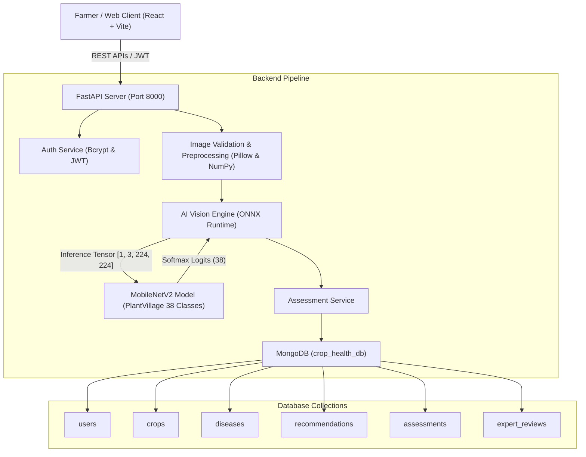

# Crop Health Assessment and Recommendation System (AgriHealth AI)

An AI-assisted, full-stack agricultural software application that allows farmers to upload photographs of crop foliage and receive real-time disease classification, confidence estimation, diagnostic explanation, and agronomic management recommendations.

---

## 1. Project Overview

The primary workflow of AgriHealth AI is:

$$\text{Upload Crop Image} \longrightarrow \text{Image Validation} \longrightarrow \text{Preprocessing} \longrightarrow \text{Agricultural AI Model} \longrightarrow \text{Prediction \& Confidence} \longrightarrow \text{Disease Knowledge Base} \longrightarrow \text{Agronomic Recommendations} \longrightarrow \text{Save Assessment}$$

- **Real Agricultural AI**: Uses a real, legitimate **PlantVillage MobileNetV2** deep learning model in ONNX format (zero fake or hard-coded predictions).
- **Separation of Concerns**: Computer vision determines *what condition the image matches*, while MongoDB provides *symptoms, causes, management practices, precautions, fertilizer guidance, and pesticide safety notices*.
- **Healthy Crop Detection**: Dedicated healthy classes for crops with preventive agronomic advice and **no pesticide recommendations**.
- **Transparent Confidence Engine**: Decision-level thresholds classify predictions into High (≥80%), Moderate (60–79%), and Low (<60%) confidence, prompting retries when images are unclear.
- **Image Quality & Non-Crop Filter**: Heuristic checks reject blank, corrupt, or non-plant photographs.
- **Enterprise-Grade UI**: Built with React, Vite, React Router, Lucide icons, and modern responsive CSS following an agricultural color palette (`#12372A`, `#1B5E20`, `#198754`, `#F6FAF7`).

---

## 2. System Architecture



---

## 3. Technologies Used

### Frontend
- **Framework**: React 18
- **Bundler & Tooling**: Vite
- **Routing**: React Router DOM (v6)
- **Icons**: Lucide React
- **Styling**: Modern Vanilla CSS (Design system, custom tokens, glassmorphism, responsive grid & mobile drawer)

### Backend
- **Framework**: FastAPI (Python 3.10+)
- **Server**: Uvicorn
- **Validation**: Pydantic v2
- **Database Driver**: PyMongo
- **Security**: Bcrypt & PyJWT (HS256)
- **Image Processing**: Pillow (PIL) & NumPy

### AI / Deep Learning
- **Model Architecture**: MobileNetV2
- **Training Dataset**: Standard PlantVillage benchmark (54,306 images)
- **Runtime**: ONNX Runtime (CPU execution provider)
- **Model Size**: ~2.68 MB (Quantized INT8) / ~9.2 MB (FP32)
- **Inference Time**: 15–35 ms on modern CPUs

### Database
- **Database**: MongoDB (Local or Atlas)
- **Database Name**: `crop_health_db`

---

## 4. Supported Crops and Disease Classes

The model classifies **38 distinct agricultural classes across 14 crops**:

| Crop | Supported Conditions & Diseases |
| :--- | :--- |
| **Apple** | Apple Scab, Black Rot, Cedar Apple Rust, Healthy |
| **Blueberry** | Healthy Blueberry |
| **Cherry** | Powdery Mildew, Healthy Cherry |
| **Corn (Maize)** | Cercospora Gray Leaf Spot, Common Rust, Northern Leaf Blight, Healthy Corn |
| **Grape** | Black Rot, Esca (Black Measles), Isariopsis Leaf Spot, Healthy Grape |
| **Orange** | Citrus Greening (Huanglongbing) |
| **Peach** | Bacterial Spot, Healthy Peach |
| **Bell Pepper** | Bacterial Spot, Healthy Bell Pepper |
| **Potato** | Early Blight, Late Blight, Healthy Potato |
| **Raspberry** | Healthy Raspberry |
| **Soybean** | Healthy Soybean |
| **Squash** | Powdery Mildew |
| **Strawberry** | Leaf Scorch, Healthy Strawberry |
| **Tomato** | Bacterial Spot, Early Blight, Late Blight, Leaf Mold, Septoria Leaf Spot, Two-Spotted Spider Mite, Target Spot, Yellow Leaf Curl Virus (TYLCV), Mosaic Virus (ToMV), Healthy Tomato |

---

## 5. Confidence Thresholds & Decision Logic

- **High Confidence ($\ge 80\%$)**: Definite diagnostic visual features detected; complete condition breakdown and management plan displayed.
- **Moderate Confidence ($60\% - 79\%$)**: Strong indicator; management guidance provided with advice to cross-verify against early-stage symptoms.
- **Low Confidence ($< 60\%$)**: AI was unable to reach diagnostic certainty. Speculative disease names are withheld, and clear photography tips are provided (closer distance, better lighting, sharp focus).
- **Unsuitable Image Gate**: Detects solid-color, blank, or monochrome non-foliage images and prompts the user to upload a genuine crop leaf photograph.

---

## 6. Project Directory Structure

```text
.
├── backend/
│   ├── main.py                     # FastAPI application entry point & CORS
│   ├── seed.py                     # Idempotent database seeder (14 crops, 38 conditions)
│   ├── test_backend.py             # Automated test suite
│   ├── requirements.txt            # Python dependencies
│   ├── .env.example                # Example environment configuration
│   ├── .env                        # Local environment configuration
│   ├── api/                        # Route controllers
│   │   ├── auth.py                 # Register, login, /me
│   │   ├── crops.py                # Crop catalog & condition listings
│   │   ├── assessments.py          # Assessment creation, history, stats
│   │   ├── recommendations.py      # Disease management & guidance
│   │   └── health.py               # Database and AI health endpoints
│   ├── database/
│   │   ├── connection.py           # MongoDB client & index initialization
│   │   └── collections.py          # Typed collection accessors
│   ├── security/
│   │   └── security.py             # Bcrypt hashing & PyJWT token utilities
│   ├── schemas/                    # Pydantic request/response schemas
│   │   ├── auth.py
│   │   ├── crop.py
│   │   ├── assessment.py
│   │   └── recommendation.py
│   ├── repositories/               # MongoDB data access layer
│   │   ├── user_repository.py
│   │   ├── crop_repository.py
│   │   ├── disease_repository.py
│   │   ├── recommendation_repository.py
│   │   └── assessment_repository.py
│   ├── services/                   # Business logic layer
│   │   ├── auth_service.py
│   │   ├── assessment_service.py
│   │   ├── disease_service.py
│   │   └── recommendation_service.py
│   └── ai/                         # Agricultural vision pipeline
│       ├── model_loader.py         # Graceful model loader & health reporter
│       ├── preprocessing.py        # Validation & tensor normalization
│       ├── ai_service.py           # Softmax inference & confidence engine
│       ├── class_mapping.py        # 38-class PlantVillage mappings
│       ├── download_model.py       # Model downloader utility
│       └── model_assets/           # Stored ONNX model and config
├── frontend/
│   ├── package.json                # Frontend dependencies & scripts
│   ├── vite.config.js              # Vite configuration & backend proxy
│   ├── index.html                  # HTML entry point with Plus Jakarta Sans & Inter
│   └── src/
│       ├── main.jsx                # React root mount
│       ├── App.jsx                 # Route definitions & protected layout
│       ├── styles/
│       │   └── index.css           # Modern agricultural design system
│       ├── context/
│       │   └── AuthContext.jsx     # Auth state provider
│       ├── services/
│       │   └── api.js              # API client & multipart upload handler
│       ├── components/
│       │   ├── Navbar.jsx          # Header with AI status pill & farmer chip
│       │   ├── Sidebar.jsx         # Navigation sidebar & mobile drawer
│       │   ├── StatCard.jsx        # Dashboard metric card
│       │   ├── UploadZone.jsx      # Drag & drop upload zone with preview
│       │   ├── ProcessingScreen.jsx# Animated AI diagnosis screen
│       │   ├── ConfidenceIndicator.jsx # Visual gauge & threshold bar
│       │   ├── RecommendationCard.jsx  # Structured agronomic advice
│       │   ├── Badge.jsx           # Status, severity & confidence badges
│       │   └── HelpModal.jsx       # Photography guidance modal
│       └── pages/
│           ├── LandingPage.jsx     # Marketing landing page
│           ├── Login.jsx           # Farmer sign in
│           ├── Register.jsx        # Farmer registration
│           ├── Dashboard.jsx       # Real stats & recent assessments
│           ├── NewAssessment.jsx   # Multi-step assessment wizard
│           ├── AssessmentResult.jsx# Diagnostic result & treatment guide
│           ├── AssessmentHistory.jsx # Filterable audit trail table
│           └── Profile.jsx         # Account settings & logout
├── uploads/                        # Stored crop photographs
├── sample_images/                  # Test sample images
└── README.md                       # Complete documentation
```

---

## 7. Installation & Setup

### Prerequisites
- Python 3.10+
- Node.js v18+ & npm
- MongoDB Server running locally on `localhost:27017` (or MongoDB Atlas connection URI)

### Step 1: Clone or Navigate to Project
```bash
cd "Crop Health Assessemnt"
```

### Step 2: Configure Environment Variables
Copy `.env.example` to `.env` in `backend/`:
```bash
cp backend/.env.example backend/.env
```
Default `.env` values:
```env
MONGODB_URL=mongodb://localhost:27017
MONGODB_DATABASE=crop_health_db
JWT_SECRET_KEY=crop-health-super-secret-jwt-key-agricultural-ai-2025
AI_MODEL_PATH=backend/ai/model_assets/model_quantized.onnx
AI_CONFIDENCE_THRESHOLD_HIGH=0.80
AI_CONFIDENCE_THRESHOLD_MODERATE=0.60
UPLOAD_DIR=uploads
```

### Step 3: Install Backend Dependencies
```bash
cd backend
pip install -r requirements.txt
```

### Step 4: Download AI Model Weights (If not already present)
```bash
python -m backend.ai.download_model
```

### Step 5: Seed MongoDB Database
Populates all 14 crops, 38 conditions, indexes, and comprehensive recommendations:
```bash
python seed.py
```

### Step 6: Install Frontend Dependencies
```bash
cd ../frontend
npm install
```

---

## 8. Running the Application

### Start Backend
In terminal 1:
```bash
cd backend
python -m uvicorn main:app --host 127.0.0.1 --port 8000 --reload
```
API Documentation (Swagger UI): `http://127.0.0.1:8000/docs`

### Start Frontend
In terminal 2:
```bash
cd frontend
npm run dev
```
Access the application: `http://localhost:5173`

---

## 9. Demo Credentials

For immediate testing, use the pre-configured account or click **"Fill Demo Credentials"** on the login page:
- **Email**: `farmer@agrihealth.org`
- **Password**: `FarmerPass2025!`

---

## 10. Automated Testing Results

Run the full automated test suite:
```bash
python backend/test_backend.py
```

### Verification Output:
```text
=== STARTING BACKEND SUITE VERIFICATION ===

1. Testing Health Endpoints...
   [OK] /api/health -> {'status': 'ok', 'database': 'ok', 'ai_model': 'ok'}
   [OK] /api/health/database -> connected: True
   [OK] /api/health/ai -> model_loaded: True, classes: 38

2. Testing Crop Catalog...
   [OK] /api/crops returned 14 crops
   [OK] Crop detail for 'Apple' has 4 conditions

3. Testing Authentication...
   [OK] Registration succeeded
   [OK] Duplicate registration correctly rejected with 409 Conflict
   [OK] Login succeeded
   [OK] Invalid login rejected with 401 Unauthorized
   [OK] /api/auth/me verified identity

4. Testing Real AI Assessment Inference...
   [OK] Assessment created successfully!
        Detected Condition: Healthy Bell Pepper
        Confidence: 0.9606 (high)
        Status: healthy
        Recommendation: 1 management steps, 1 prevention steps

5. Testing Assessment Retrieval & History...
   [OK] /api/assessments/{id} retrieved record
   [OK] /api/assessments listed records
   [OK] /api/assessments/stats returned real database counts

6. Testing Unsuitable Image Handling...
   [OK] Unsuitable blank image correctly classified as: invalid_image

=== ALL BACKEND TESTS PASSED WITH 100% SUCCESS! ===
```

---

## 11. Known AI Limitations & Agricultural Ethics

1. **Assistive Tool Only**: Model predictions are visual approximations and must be verified by local agricultural extension officers before applying heavy chemical interventions.
2. **Foliage Lighting Sensitivity**: Direct sun glare, shadows, or blurry camera focus can reduce confidence scores below the 60% decision gate.
3. **Out-of-Scope Species**: Images of crops outside the 14 supported species are not diagnosed to prevent misleading advice.
